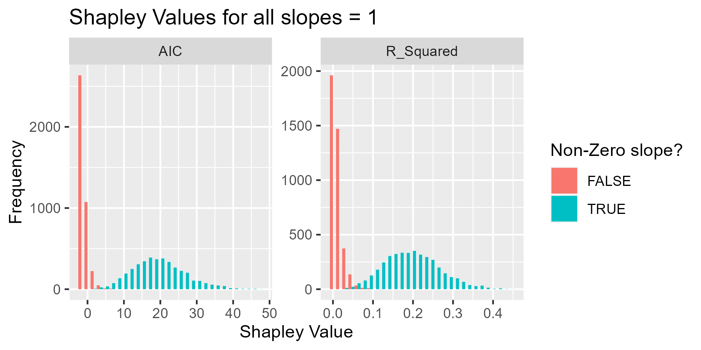

```{r setup, include=FALSE, cache=FALSE}
knitr::opts_chunk$set(echo = FALSE,cache=TRUE,warning = FALSE)
library(shapleyAIC)
library(dplyr)
library(ggplot2)
library(tidyr)
```

## Problem setting

We have a Multiple Linear Regression model:
\[Y_i = \beta_0 + \beta_1X_{i,1} + .... + \beta_pX_{i,p} + \varepsilon_{i}\]
\[\varepsilon_i\overset{i.i.d}{\sim}\mathcal{N}\left(0,\sigma^2\right)\]
and we wish to assess how "valuable" each $X$ variable is in predicting the response variable $Y$, rather than just finding an optimal subset. 

## Shapley Values

A tool from cooperative game theory, which values members of a "grand coalition" based on the marginal improvement they present when added to a coalition which plays a game together. 

The setup:

- a set $S$ of $p$ "players" 
  - in our case, this will be the explanatory variables $X_i$. 
- a characteristic function $v: 2^S\rightarrow \mathbb{R}$
  - such that $v(\emptyset)$

Based on this setup, the Shapley Value of player $x\in S$ is given by:
\[
\phi(x) = 
\sum_{i=1}^{S-1}
\sum_{s\in[S\setminus\{x\}]:|s|=i}
\frac{v(s\cup\{x\})-v(s)}{\left(\begin{array}{c}N-1\\|s|\end{array}\right)}
\]
[@ghorbani2021]

## Shapley Values in Multiple Linear Regression

There has been some work done using Shapley Values to value the explanatory variables in MLR. [@lipovetsky2001],[@lipovetsky2021] 

- $S=\{X_1,...X_p\}$
- For a subset $s\subset S$ of the variables, the characteristic function is the coefficient of determination for that subset:
  - $v(s)=R^2(s)$

Note that calculating these Shapley Values is equivalent to performing an exhaustive model search. For this reason, calculating Shapley Values is computationally very expensive, especially for larger data sets. 

## Shapley Values in Multiple Linear Regression

This does not take into account the model complexity. So, we propose using AIC to calculate the characteristic function instead, since it does take model complexity into account. Since the characteristic function must equal 0 for the empty coalition (intercept only model), we must adjust the characteristic function so that this is the case. Furthermore, since AIC is smaller for "better" models, we should adjust so that a "better" AIC has a higher Shapley Value. Therefore, the `shapleyAIC` package implements:
\[v(s) = AIC(\emptyset)-AIC(s)\]

## `shapleyAIC::shapley()`

The package `shapleyAIC` contains the function `shapley()`, which takes as inputs

- A response vector, $Y$
- A design matrix, $X$

It then does the exhaustive model search, calculates the Shapley Values, and returns

- Shapley Values using the $R^2$ characteristic function
- Shapley Values using the AIC-based characteristic function
- A subsets table which indicates the AIC and $R^2$ for every subset in the exhaustive model search. 

## An example: `swiss` data

The `swiss` data set is included in the base datasets of R. We will use the data to predict infant mortality (the sixth column). How much does each variable help to explain infant mortality?

```{r echo=TRUE}
Y <- swiss[,6]
X <- as.matrix(swiss[,1:5])
SV <- shapleyAIC::shapley(Y,X)
SV$AIC_shapleys
SV$rsq_shapleys
```
Using either characteristic function, we observe that Fertility is the most valuable, with the other variables being similarly unhelpful. 

# Simulations

## Simulations

In each of the following simulations, we will randomly generate eight covariates:
\[X_1,X_2,X_3,X_4,Z_1,Z_2,Z_3,Z_4\]
We will then generate the response variable $Y$:
\[Y = \beta_0 + \beta_1X_1 + \beta_2X_2 + \beta_3X_3 + \beta_4X_4 + \mathcal{N}(0,1)\]
Then, we will give `shapley()` a design matrix which includes all of the $X$ variables, and the $Z$ variables, and see how well it can pick out the important variables from the unhelpful ones. This will be repeated 1000 times for each of the following scenarios:

- $\beta=(1,1,1,1)^T$, $X$ and $Z$ uncorrelated
- $\beta=(1/2,1/2,1/2,1/2)^T$, $X$ and $Z$ uncorrelated
- $\beta=(1,1/2,1/3,1/4)^T$, $X$ and $Z$ uncorrelated
- $\beta=(1,1,1,1)^T$, $X$ correlated with itself, $Z$ uncorrelated
- $\beta=(1,1,1,1)^T$, $X$ and $Z$ correlated

## Simulations

In each simulation, we will consider the number of false positives. We also will consider the following ad hoc ratio:
\[
\frac{\min\{\phi(X_i)\}-\max\{\phi(Z_i)\}}{\max\{\phi(X_i),\phi(Z_j)\}-\min\{\phi(X_i),\phi(Z_j)\}}
\]
observe that this "separation ratio" takes values in $\rho\in[-1,1]$, with negative numbers indicating a false positive rate greater than 0. The larger the distance between the smallest $\phi(X_i)$ and the largest $\phi(Z_i)$, the greater the numerator becomes in absolute value. Assuming no false positives, if we let the distance between the set of $\{\phi(X_i)\}$ and $\{\phi(Z_i)\}$ get infinitely large, we get that this ratio approaches $1$. So, the better separated the two clouds of points are, the closer this ratio should be to 1. If the smallest Shapley Value is an $X$ value, and the largest shapley value is a $Z$ value, then this ratio is -1.

## $\beta=(1,1,1,1)^T$, $X$ and $Z$ uncorrelated



## $\beta=(1,1,1,1)^T$, $X$ and $Z$ uncorrelated

False positive rates:

```{r}
load("Results/trivial.RData")
#data frame for false positives
nsim <- nrow(dplyr::filter(shapleys,scorefn=="AIC"))
AICshapleys <- dplyr::filter(shapleys,scorefn=="AIC")
rsqshapleys <- dplyr::filter(shapleys,scorefn=="R_Squared")
false_positives <- data.frame(
  AIC = rep(NA,nsim),
  r_squared = rep(NA,nsim)
)

#for loop for AIC false positives
for(i in 1:nsim){
  smallest_X <- min(AICshapleys[i,1:4])
  false_positives$AIC[i]<-sum(AICshapleys[i,5:8]>smallest_X)
}

#for loop for r-squared false positives
for(i in 1:nsim){
  smallest_X <- min(rsqshapleys[i,1:4])
  false_positives$r_squared[i]<-sum(rsqshapleys[i,5:8]>smallest_X)
}

#summarize these two false-positive rates
apply(false_positives,MARGIN = 2,FUN=summary)
t(apply(false_positives,MARGIN=2,FUN=table))
```

## $\beta=(1,1,1,1)^T$, $X$ and $Z$ uncorrelated

```{r}
#plot false positives for both schemes
ggplot(false_positives,aes(x=r_squared,y=AIC))+
  geom_jitter(height=0.05,width=0.05,alpha=0.2)+
  geom_abline(slope=1,intercept=0,linetype=2,color="red")+
  labs(
    title="False Positives for two methods",
    subtitle = "Each point is one simulation. Number of false positives on x and y axes for the two methods."
    )
```

## $\beta=(1,1,1,1)^T$, $X$ and $Z$ uncorrelated

Separation Ratios: 

```{r}
#Separation Ratios
separation <- data.frame(
  AIC = rep(NA,nsim),
  r_squared = rep(NA,nsim)
)

#for loop for AIC false positives
for(i in 1:nsim){
  smallest_X <- min(AICshapleys[i,1:4])
  largest_Z  <- max(AICshapleys[i,5:8])
  smallest   <- min(AICshapleys[i,1:8])
  largest    <- max(AICshapleys[i,1:8])
  separation$AIC[i]<- (smallest_X-largest_Z)/(largest-smallest)
}

#for loop for r-squared false positives
for(i in 1:nsim){
  smallest_X <- min(rsqshapleys[i,1:4])
  largest_Z  <- max(rsqshapleys[i,5:8])
  smallest   <- min(rsqshapleys[i,1:8])
  largest    <- max(rsqshapleys[i,1:8])
  separation$r_squared [i]<- (smallest_X-largest_Z)/(largest-smallest)
}

#summarize these two separation ratios
apply(separation,MARGIN = 2,FUN=summary)
```

## $\beta=(1,1,1,1)^T$, $X$ and $Z$ uncorrelated

```{r}
#AIC shapley values achieve "Better separation"
ggplot(separation,aes(x=r_squared,y=AIC))+
  geom_point(alpha=0.3)+
  geom_abline(slope=1,intercept=0,linetype=2,color="red")+
  labs(
    title="\"Separation ratios\" for the two methods",
    subtitle="(Larger is better)"
  )
```

## $\beta=(1/2,1/2,1/2,1/2)^T$, $X$ and $Z$ uncorrelated

```{r}
load("Results/half-trivial.RData")

#Histograms
shapleys%>%
  pivot_longer(1:8,names_to = "variable",values_to = "shapley_value")%>%
  mutate(var_useful = grepl("X",variable))%>%
  ggplot(aes(x=shapley_value,fill=var_useful))+
  geom_histogram(position = "dodge",bins=30)+
  facet_wrap(~scorefn,scales="free")+
  labs(
    title="Shapley Values for all slopes = 1/2",
    x = "Shapley Value",
    y = "Frequency",
    fill="Non-Zero slope?"
  )
```


## $\beta=(1/2,1/2,1/2,1/2)^T$, $X$ and $Z$ uncorrelated

False positive rates:

```{r}
#data frame for false positives
nsim <- nrow(filter(shapleys,scorefn=="AIC"))
AICshapleys <- filter(shapleys,scorefn=="AIC")
rsqshapleys <- filter(shapleys,scorefn=="R_Squared")
false_positives <- data.frame(
  AIC = rep(NA,nsim),
  r_squared = rep(NA,nsim)
)

#for loop for AIC false positives
for(i in 1:nsim){
  smallest_X <- min(AICshapleys[i,1:4])
  false_positives$AIC[i]<-sum(AICshapleys[i,5:8]>smallest_X)
}

#for loop for r-squared false positives
for(i in 1:nsim){
  smallest_X <- min(rsqshapleys[i,1:4])
  false_positives$r_squared[i]<-sum(rsqshapleys[i,5:8]>smallest_X)
}

#summarize these two false-positive rates
apply(false_positives,MARGIN = 2,FUN=summary)
t(apply(false_positives,MARGIN=2,FUN=table))
```

## $\beta=(1/2,1/2,1/2,1/2)^T$, $X$ and $Z$ uncorrelated

```{r}
#plot false positives for both schemes 
ggplot(false_positives,aes(x=r_squared,y=AIC))+
  geom_jitter(height=0.05,width=0.05,alpha=0.2)+
  geom_abline(slope=1,intercept=0,linetype=2,color="red")+
  labs(
    title="False Positives for two methods",
    subtitle = "Each point is one simulation. Number of false positives on x and y axes for the two methods."
    )
```

## $\beta=(1/2,1/2,1/2,1/2)^T$, $X$ and $Z$ uncorrelated

Separation Ratios: 

```{r}
#Separation Ratios
separation <- data.frame( 
  AIC = rep(NA,nsim),
  r_squared = rep(NA,nsim)
)

#for loop for AIC false positives
for(i in 1:nsim){
  smallest_X <- min(AICshapleys[i,1:4])
  largest_Z  <- max(AICshapleys[i,5:8])
  smallest   <- min(AICshapleys[i,1:8])
  largest    <- max(AICshapleys[i,1:8])
  separation$AIC[i]<- (smallest_X-largest_Z)/(largest-smallest)
}

#for loop for r-squared false positives
for(i in 1:nsim){
  smallest_X <- min(rsqshapleys[i,1:4])
  largest_Z  <- max(rsqshapleys[i,5:8])
  smallest   <- min(rsqshapleys[i,1:8])
  largest    <- max(rsqshapleys[i,1:8])
  separation$r_squared [i]<- (smallest_X-largest_Z)/(largest-smallest)
}

#summarize these two separation ratios
apply(separation,MARGIN = 2,FUN=summary)
```

## $\beta=(1/2,1/2,1/2,1/2)^T$, $X$ and $Z$ uncorrelated

```{r}
#AIC shapley values achieve "Better separation"
ggplot(separation,aes(x=r_squared,y=AIC))+ 
  geom_point(alpha=0.3)+
  geom_abline(slope=1,intercept=0,linetype=2,color="red")+
  labs(
    title="\"Separation ratios\" for the two methods",
    subtitle="(Larger is better)"
  )
```

## $\beta=(1,1/2,1/3,1/4)^T$, $X$ and $Z$ uncorrelated

```{r}
load("Results/one-half-third-fourth.RData")

#Histograms
shapleys%>%
  pivot_longer(1:8,names_to = "variable",values_to = "shapley_value")%>%
  mutate(var_useful = grepl("X",variable))%>%
  ggplot(aes(x=shapley_value,fill=var_useful))+
  geom_histogram(position = "dodge",bins=30)+
  facet_wrap(~scorefn,scales="free")+
  labs(
    title="Shapley Values",
    x = "Shapley Value",
    y = "Frequency",
    fill="Non-Zero slope?"
  )
```


## $\beta=(1,1/2,1/3,1/4)^T$, $X$ and $Z$ uncorrelated

False positive rates:

```{r}
#data frame for false positives
nsim <- nrow(filter(shapleys,scorefn=="AIC"))
AICshapleys <- filter(shapleys,scorefn=="AIC")
rsqshapleys <- filter(shapleys,scorefn=="R_Squared")
false_positives <- data.frame(
  AIC = rep(NA,nsim),
  r_squared = rep(NA,nsim)
)

#for loop for AIC false positives
for(i in 1:nsim){
  smallest_X <- min(AICshapleys[i,1:4])
  false_positives$AIC[i]<-sum(AICshapleys[i,5:8]>smallest_X)
}

#for loop for r-squared false positives
for(i in 1:nsim){
  smallest_X <- min(rsqshapleys[i,1:4])
  false_positives$r_squared[i]<-sum(rsqshapleys[i,5:8]>smallest_X)
}

#summarize these two false-positive rates
apply(false_positives,MARGIN = 2,FUN=summary)
t(apply(false_positives,MARGIN=2,FUN=table))
```

## $\beta=(1,1/2,1/3,1/4)^T$, $X$ and $Z$ uncorrelated

```{r}
#plot false positives for both schemes 
ggplot(false_positives,aes(x=r_squared,y=AIC))+
  geom_jitter(height=0.05,width=0.05,alpha=0.2)+
  geom_abline(slope=1,intercept=0,linetype=2,color="red")+
  labs(
    title="False Positives for two methods",
    subtitle = "Each point is one simulation. Number of false positives on x and y axes for the two methods."
    )
```

## $\beta=(1,1/2,1/3,1/4)^T$, $X$ and $Z$ uncorrelated

Separation Ratios: 

```{r}
#Separation Ratios
separation <- data.frame( 
  AIC = rep(NA,nsim),
  r_squared = rep(NA,nsim)
)

#for loop for AIC false positives
for(i in 1:nsim){
  smallest_X <- min(AICshapleys[i,1:4])
  largest_Z  <- max(AICshapleys[i,5:8])
  smallest   <- min(AICshapleys[i,1:8])
  largest    <- max(AICshapleys[i,1:8])
  separation$AIC[i]<- (smallest_X-largest_Z)/(largest-smallest)
}

#for loop for r-squared false positives
for(i in 1:nsim){
  smallest_X <- min(rsqshapleys[i,1:4])
  largest_Z  <- max(rsqshapleys[i,5:8])
  smallest   <- min(rsqshapleys[i,1:8])
  largest    <- max(rsqshapleys[i,1:8])
  separation$r_squared [i]<- (smallest_X-largest_Z)/(largest-smallest)
}

#summarize these two separation ratios
apply(separation,MARGIN = 2,FUN=summary)
```

## $\beta=(1,1/2,1/3,1/4)^T$, $X$ and $Z$ uncorrelated

```{r}
#AIC shapley values achieve "Better separation"
ggplot(separation,aes(x=r_squared,y=AIC))+ 
  geom_point(alpha=0.3)+
  geom_abline(slope=1,intercept=0,linetype=2,color="red")+
  labs(
    title="\"Separation ratios\" for the two methods",
    subtitle="(Larger is better)"
  )
```

## $\beta=(1,1,1,1)^T$, $X$ correlated, $Z$ uncorrelated

```{r}
load("Results/x-correlated.RData")

#Histograms
shapleys%>%
  pivot_longer(1:8,names_to = "variable",values_to = "shapley_value")%>%
  mutate(var_useful = grepl("X",variable))%>%
  ggplot(aes(x=shapley_value,fill=var_useful))+
  geom_histogram(position = "dodge",bins=30)+
  facet_wrap(~scorefn,scales="free")+
  labs(
    title="Shapley Values",
    x = "Shapley Value",
    y = "Frequency",
    fill="Non-Zero slope?"
  )
```


## $\beta=(1,1,1,1)^T$, $X$ correlated, $Z$ uncorrelated

False positive rates:

```{r}
#data frame for false positives
nsim <- nrow(filter(shapleys,scorefn=="AIC"))
AICshapleys <- filter(shapleys,scorefn=="AIC")
rsqshapleys <- filter(shapleys,scorefn=="R_Squared")
false_positives <- data.frame(
  AIC = rep(NA,nsim),
  r_squared = rep(NA,nsim)
)

#for loop for AIC false positives
for(i in 1:nsim){
  smallest_X <- min(AICshapleys[i,1:4])
  false_positives$AIC[i]<-sum(AICshapleys[i,5:8]>smallest_X)
}

#for loop for r-squared false positives
for(i in 1:nsim){
  smallest_X <- min(rsqshapleys[i,1:4])
  false_positives$r_squared[i]<-sum(rsqshapleys[i,5:8]>smallest_X)
}

#summarize these two false-positive rates
apply(false_positives,MARGIN = 2,FUN=summary)
t(apply(false_positives,MARGIN=2,FUN=table))
```

## $\beta=(1,1,1,1)^T$, $X$ correlated, $Z$ uncorrelated

```{r}
#plot false positives for both schemes 
ggplot(false_positives,aes(x=r_squared,y=AIC))+
  geom_jitter(height=0.05,width=0.05,alpha=0.2)+
  geom_abline(slope=1,intercept=0,linetype=2,color="red")+
  labs(
    title="False Positives for two methods",
    subtitle = "Each point is one simulation. Number of false positives on x and y axes for the two methods."
    )
```

## $\beta=(1,1,1,1)^T$, $X$ correlated, $Z$ uncorrelated

Separation Ratios: 

```{r}
#Separation Ratios
separation <- data.frame( 
  AIC = rep(NA,nsim),
  r_squared = rep(NA,nsim)
)

#for loop for AIC false positives
for(i in 1:nsim){
  smallest_X <- min(AICshapleys[i,1:4])
  largest_Z  <- max(AICshapleys[i,5:8])
  smallest   <- min(AICshapleys[i,1:8])
  largest    <- max(AICshapleys[i,1:8])
  separation$AIC[i]<- (smallest_X-largest_Z)/(largest-smallest)
}

#for loop for r-squared false positives
for(i in 1:nsim){
  smallest_X <- min(rsqshapleys[i,1:4])
  largest_Z  <- max(rsqshapleys[i,5:8])
  smallest   <- min(rsqshapleys[i,1:8])
  largest    <- max(rsqshapleys[i,1:8])
  separation$r_squared [i]<- (smallest_X-largest_Z)/(largest-smallest)
}

#summarize these two separation ratios
apply(separation,MARGIN = 2,FUN=summary)
```

## $\beta=(1,1,1,1)^T$, $X$ correlated, $Z$ uncorrelated

```{r}
#AIC shapley values achieve "Better separation"
ggplot(separation,aes(x=r_squared,y=AIC))+ 
  geom_point(alpha=0.3)+
  geom_abline(slope=1,intercept=0,linetype=2,color="red")+
  labs(
    title="\"Separation ratios\" for the two methods",
    subtitle="(Larger is better)"
  )
```

## $\beta=(1,1,1,1)^T$, $X$ and $Z$ correlated

```{r}
load("Results/x-z-correlated.RData")

#Histograms
shapleys%>%
  pivot_longer(1:8,names_to = "variable",values_to = "shapley_value")%>%
  mutate(var_useful = grepl("X",variable))%>%
  ggplot(aes(x=shapley_value,fill=var_useful))+
  geom_histogram(position = "dodge",bins=30)+
  facet_wrap(~scorefn,scales="free")+
  labs(
    title="Shapley Values",
    x = "Shapley Value",
    y = "Frequency",
    fill="Non-Zero slope?"
  )
```


## $\beta=(1,1,1,1)^T$, $X$ and $Z$ correlated

False positive rates:

```{r}
#data frame for false positives
nsim <- nrow(filter(shapleys,scorefn=="AIC"))
AICshapleys <- filter(shapleys,scorefn=="AIC")
rsqshapleys <- filter(shapleys,scorefn=="R_Squared")
false_positives <- data.frame(
  AIC = rep(NA,nsim),
  r_squared = rep(NA,nsim)
)

#for loop for AIC false positives
for(i in 1:nsim){
  smallest_X <- min(AICshapleys[i,1:4])
  false_positives$AIC[i]<-sum(AICshapleys[i,5:8]>smallest_X)
}

#for loop for r-squared false positives
for(i in 1:nsim){
  smallest_X <- min(rsqshapleys[i,1:4])
  false_positives$r_squared[i]<-sum(rsqshapleys[i,5:8]>smallest_X)
}

#summarize these two false-positive rates
apply(false_positives,MARGIN = 2,FUN=summary)
t(apply(false_positives,MARGIN=2,FUN=table))
```

## $\beta=(1,1,1,1)^T$, $X$ and $Z$ correlated

```{r}
#plot false positives for both schemes 
ggplot(false_positives,aes(x=r_squared,y=AIC))+
  geom_jitter(height=0.05,width=0.05,alpha=0.2)+
  geom_abline(slope=1,intercept=0,linetype=2,color="red")+
  labs(
    title="False Positives for two methods",
    subtitle = "Each point is one simulation. Number of false positives on x and y axes for the two methods."
    )
```

## $\beta=(1,1,1,1)^T$, $X$ and $Z$ correlated

Separation Ratios: 

```{r}
#Separation Ratios
separation <- data.frame( 
  AIC = rep(NA,nsim),
  r_squared = rep(NA,nsim)
)

#for loop for AIC false positives
for(i in 1:nsim){
  smallest_X <- min(AICshapleys[i,1:4])
  largest_Z  <- max(AICshapleys[i,5:8])
  smallest   <- min(AICshapleys[i,1:8])
  largest    <- max(AICshapleys[i,1:8])
  separation$AIC[i]<- (smallest_X-largest_Z)/(largest-smallest)
}

#for loop for r-squared false positives
for(i in 1:nsim){
  smallest_X <- min(rsqshapleys[i,1:4])
  largest_Z  <- max(rsqshapleys[i,5:8])
  smallest   <- min(rsqshapleys[i,1:8])
  largest    <- max(rsqshapleys[i,1:8])
  separation$r_squared [i]<- (smallest_X-largest_Z)/(largest-smallest)
}

#summarize these two separation ratios
apply(separation,MARGIN = 2,FUN=summary)
```

## $\beta=(1,1,1,1)^T$, $X$ and $Z$ correlated

```{r}
#AIC shapley values achieve "Better separation"
ggplot(separation,aes(x=r_squared,y=AIC))+ 
  geom_point(alpha=0.3)+
  geom_abline(slope=1,intercept=0,linetype=2,color="red")+
  labs(
    title="\"Separation ratios\" for the two methods",
    subtitle="(Larger is better)"
  )
```

## Conclusions

In some settings, using AIC for the characteristic function appears to grant a slight edge over $R^2$ in terms of false positive rates, and in terms of our ad-hoc "separation ratio." Calculating these shapley values is quite expensive. Further research into the theoretical meaning behind these ratios could grant insight into how useful they actually are as a tool for model selection and variable valuation. Further work could be implemented to more efficiently parallelize the shapley value calculations, or to produce approximations which are less time consuming. 

## References
